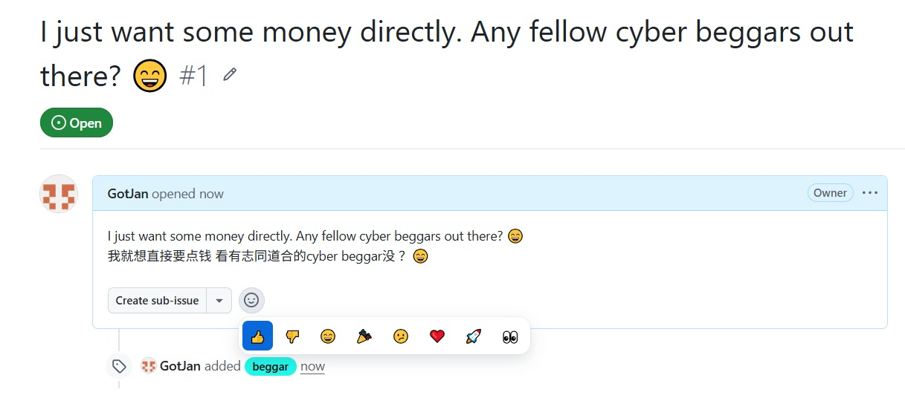

# 🪙 CyberBeggar

> A cyber begging ground where developers post payment QR codes with creative begging slogans.

Most indie projects sink without a trace. The ones that don't cost months of sweat and a lot of luck. Why not skip the gamble and just ask?

CyberBeggar cuts out the middleman. No product to ship, no users to acquire, no algorithm to please. Just you, your QR code, and your best pitch. If your words move someone — or your story breaks their heart — they pay you directly. No platform cut. No waiting. No luck required.

Someone might pay for your creativity, your humor, or simply your honesty. That's the whole point.

**They build products. We beg with style. 🪙**

---

<table>
<tr>
<td width="50%" valign="top">

## 🔥 Hot Beggars

> 🗳️ Click the 👍 badge to open the Issue, then hit 👍 to vote!

<details>
<summary>📖 How to vote (点击展开)</summary>



</details>

| 👍 | Beggar | Slogan |
|----|--------|--------|

<!-- HOT_BEGGARS_START -->
| 👍 | Beggar | Slogan |
|----|--------|--------|
| [👍 1](https://github.com/GotJan/cyberbeggar/issues/1) | [GotJan](https://github.com/GotJan) | I just want some money directly. Any fellow cyber beggars ou |
<!-- HOT_BEGGARS_END -->

## 🆕 Latest Beggars

<!-- LATEST_BEGGARS_START -->
| Beggar | Slogan |
|--------|--------|
| [GotJan](https://github.com/GotJan) | [I just want some money directly. Any fellow cyber beggars ou](https://github.com/GotJan/cyberbeggar/issues/1) |
<!-- LATEST_BEGGARS_END -->

</td>
<td width="50%" valign="top">

## 🔥 热门要饭

> 🗳️ 点 👍 徽章跳转 Issue，点 👍 投票！

<details>
<summary>📖 如何投票 (点击展开)</summary>


</details>

| 👍 | 乞丐 | 口号 |
|----|------|------|

<!-- HOT_BEGGARS_ZH_START -->
| 👍 | 乞丐 | 口号 |
|----|------|------|
| [👍 1](https://github.com/GotJan/cyberbeggar/issues/1) | [GotJan](https://github.com/GotJan) | I just want some money directly. Any fellow cyber beggars ou |
<!-- HOT_BEGGARS_ZH_END -->

## 🆕 最新要饭

<!-- LATEST_BEGGARS_ZH_START -->
| 乞丐 | 口号 |
|------|------|
| [GotJan](https://github.com/GotJan) | [I just want some money directly. Any fellow cyber beggars ou](https://github.com/GotJan/cyberbeggar/issues/1) |
<!-- LATEST_BEGGARS_ZH_END -->

</td>
</tr>
</table>

---

<table>
<tr>
<td width="50%" valign="top">

## How to Join

1. **Fork** this repo
2. **Add** your payment QR code to `assets/` (e.g. `assets/yourname-wechat.png`)
3. **Create** `contributors/yourname.md` with your begging slogan
4. **Submit** a Pull Request

### Voting

- See a great begging slogan? Go to the Issue and hit 👍
- Top-voted slogans rise to the **Hot Beggars** board
- README auto-refreshes every 6 hours via GitHub Actions

### How to Get Votes

1. After your PR is merged, [create an Issue](../../issues/new) with the `beggar` label
2. Write your slogan as the Issue title
3. People vote by hitting 👍 on your Issue

### Rules

- ✅ Personal payment QR codes only (WeChat Pay, Alipay, PayPal.me, etc.)
- ✅ Links in slogans are welcome (your project, blog, portfolio, etc.)
- ❌ No crypto addresses
- ❌ No paid placement or bribery for votes
- ❌ No NSFW content (images limited to payment QR codes, avatars, and project screenshots)
- ❌ No phishing or malicious links
- ✅ Creative, funny, or heartbreaking slogans welcomed
- ❌ No offensive or illegal content
- ⚠️ You are solely responsible for your own QR code, links, and their compliance with local laws

### Contributor Template

Create `contributors/yourname.md`:

```markdown
## yourname

> Your best begging slogan here


```

### File Structure

```
cyberbeggar/
├── README.md
├── contributors/
│   └── yourname.md
├── assets/
│   └── yourname-wechat.png
├── scripts/
│   └── update_readme.py
└── .github/
    └── workflows/
        └── update-readme.yml
```

</td>
<td width="50%" valign="top">

## 如何加入

1. **Fork** 本仓库
2. **添加** 你的收款码到 `assets/`（如 `assets/yourname-wechat.png`）
3. **创建** `contributors/yourname.md`，写上你的要饭口号
4. **提交** Pull Request

### 投票

- 看到绝妙的要饭口号？去对应 Issue 点 👍
- 得票最多的口号登上 **热门要饭** 榜
- README 通过 GitHub Actions 每 6 小时自动刷新

### 如何获得投票

1. PR 合并后，[创建一个 Issue](../../issues/new)，加上 `beggar` 标签
2. 把你的要饭口号写在 Issue 标题里
3. 大家在你的 Issue 上点 👍 投票

### 规则

- ✅ 仅限个人收款码（微信支付、支付宝、PayPal.me 等）
- ✅ 口号中可以带链接（你的项目、博客、主页等）
- ❌ 禁止加密货币地址
- ❌ 禁止付费上榜或刷票
- ❌ 禁止 NSFW 内容（图片仅限收款码、头像、项目截图）
- ❌ 禁止钓鱼或恶意链接
- ✅ 欢迎创意、搞笑、扎心的要饭口号
- ❌ 禁止违规或违法内容
- ⚠️ 你对自己的收款码、链接及其合规性负全部责任

### 贡献者模板

创建 `contributors/yourname.md`：

```markdown
## yourname

> 在这里写你最绝的要饭口号


```

### 文件结构

```
cyberbeggar/
├── README.md
├── contributors/
│   └── yourname.md
├── assets/
│   └── yourname-wechat.png
├── scripts/
│   └── update_readme.py
└── .github/
    └── workflows/
        └── update-readme.yml
```

</td>
</tr>
</table>

---

<div align="center">

**They build products. We beg with style. 🪙**

If you actually got paid — congrats, you lucky bastard. 🎉

[Submit Your QR Code](../../issues/new?labels=beggar) · [Vote for Best Beggar](../../issues?q=label%3Abeggar)

</div>

---

## 👑 Founder's Corner

<div align="center">

> I just want some money directly. Any fellow cyber beggars out there? 😄


&nbsp;&nbsp;


</div>

## License

MIT


